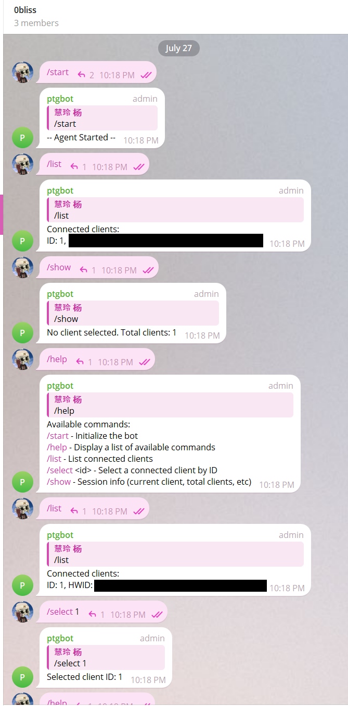
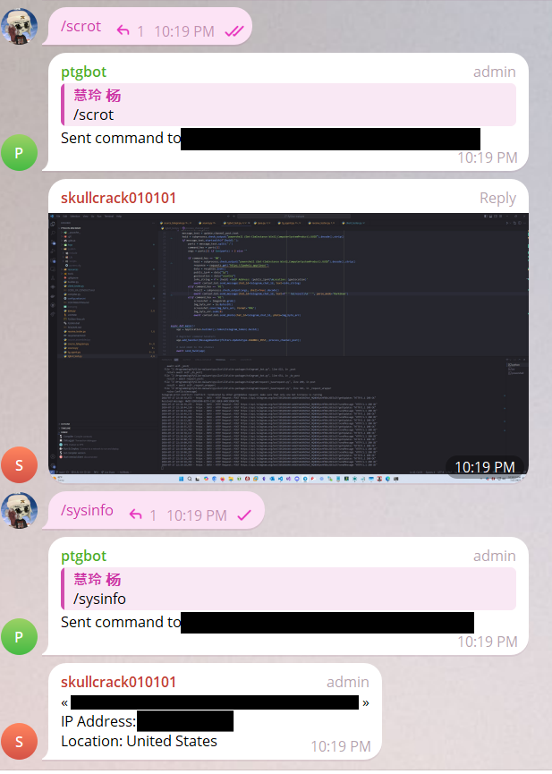
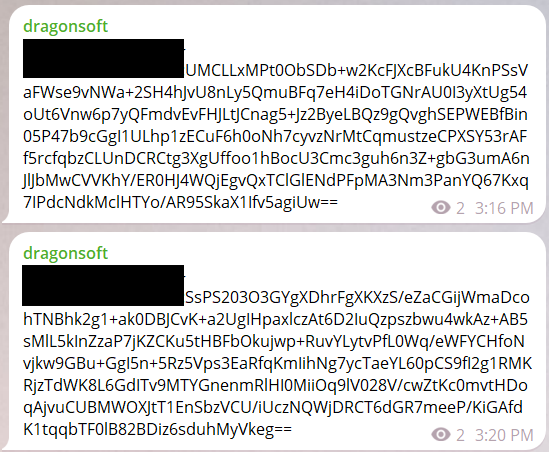

# Telegram C2 (TGC2)

This project implements a lightweight Command and Control (C2) system using the Telegram API. It comprises two main components: the Agent Bot and the Client Bot. The Agent Bot acts as the controller, while the Client Bot acts as the target device. The system leverages Telegram channels for communication, maintaining simplicity and minimizing resource usage.

What makes this implementation unique is that it supports multiple clients and client code is much lighter compared to approaches that implement telegram command handling (`/{command}`) in the client.

Inspired by Pysilon Discord RAT 

## Prerequisites

- Python 3.7+
- Telegram Bot Token for the Agent and Client bots

## Features

This version includes a very minimal feature set as proof of concept. Command execution, screenshot, and device info. The implant can easily be expanded to include other features. 

## Architecture

The architecture of this system involves two separate bots (each with its own Telegram API key), a Telegram group, and a Telegram channel. 

By using two separate bots, the client-side (implant) code remains minimal and focused on executing commands and reporting back to the channel. This reduces the footprint on the client device, making the implant less detectable and easier to manage.

The agent bot is also used to maintain state as compared to a Discord C2 which leverages features like categories and channels to maintain state. 

### Agent Bot

The Agent Bot handles commands from the user and sends them to the Telegram channel. It also manages the list of connected clients.

### Client Bot

The Client Bot registers itself with the Telegram channel using a unique Hardware ID (HWID) and executes commands sent to it. The results are then posted back to the Telegram channel.

### Group (User Interaction)
A group is used to interact with the agent, the Agent Bot controls state and communication with bots.

### Channel (Bot-to-bot Interaction)
Bots are unable to interact with other bots from within a group. Keeping bot communication in a separate channel also keeps things clean and serves the purpose of a log. 

## Disclaimer

This software is provided for educational and proof-of-concept purposes only. It is intended to demonstrate the technical implementation of a Command and Control (C2) system using the Telegram API. The developers of this software offer no warranty, express or implied, regarding its functionality or performance. Users of this software assume all responsibility and liability for its use. The developers are not liable for any misuse or damage resulting from the use of this software. Please ensure that you have proper authorization before using this software in any environment. Unauthorized use is strictly prohibited and may violate applicable laws.